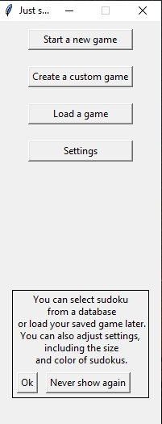
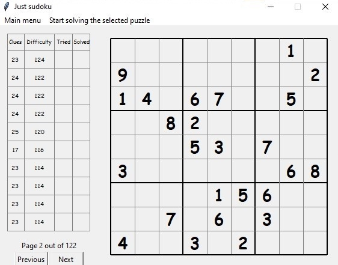
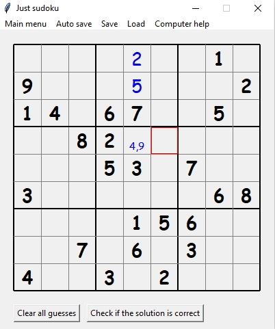
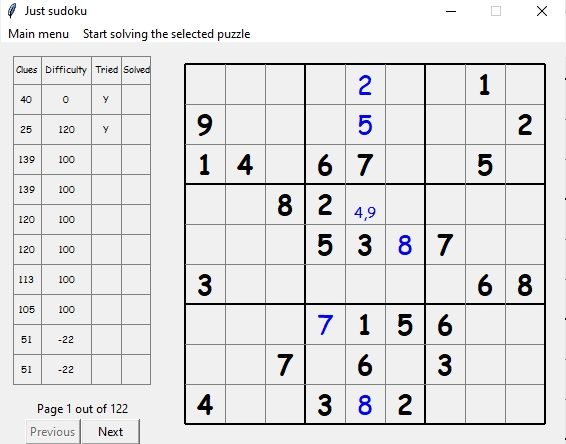
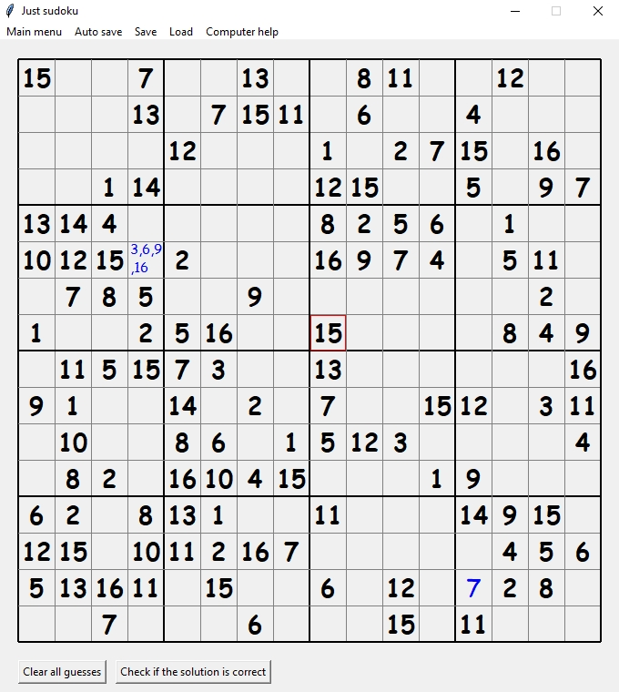
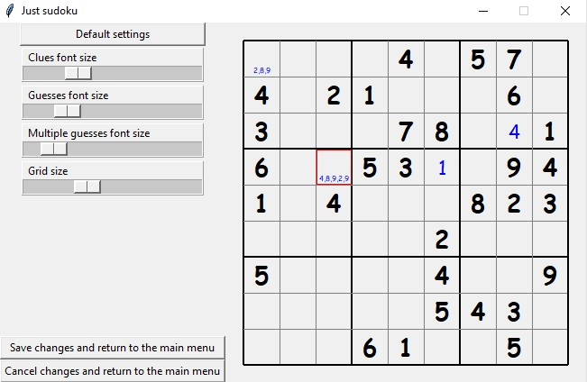
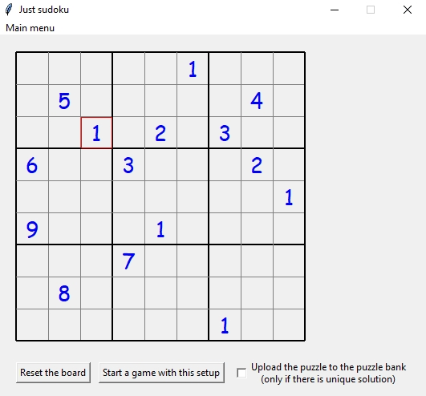

# Sudoku
## Python project for enjoying sudoku on your local machine.

### Overview
Run "Just sudoku.py" or just download "dist" folder and use "Just sudoku.exe" (no Python needed).

Customizable settings, over 1000 puzzles and the ability to generate more! 

Your games are autosaved and are loaded automatically later, so no need to worry about losing your progress!

Allows checking your solutions and using computer help if you feel unsure, or just stuck on a really hard Sudoku. 

### GUI

 Interactive GUI, including the ability to enter and check your sudokus, save and load your games and a puzzle bank with about 1000 sudokus of various difficulty. 
 

  
 Hide details 

When you load the game, you will go to the main menu. Once clicked on the new game, you will be moved to the game selection window. You can order games by difficulty, number of clues, and whether you tried or completed the puzzle before. You can preview each puzzle on your right simply by rightclicking it, and then pressing "Start solving the selected puzzle" once you see a puzzle you like. 

 

Once you select a puzzle you will be in the game solving mode. Note that in game, multiple guesses can be displayed. You can do it simply by pressing one of "/", ",", "." or " " before each new guess. You can erase one guess at a time by pressing Backspace or all of them at once by pressing Delete. You can control the position of the cursor (active cell) using your mouse, or using the arrow keys on your keyboard. This makes the experience easier when the mouse is not connected. 

  

When leaving the game window (or every 5 minutes), your progress is autosaved. Next time in the game selection you will see your autosaves for all sudokus that you attempted in the past (but of course you can clear all guesses and begin again). In the main menu there is also going to be an option to load last autosave to easily continue where you left off last time. You can also save and load your game using custom names if you want to find a specific puzzle easily later (e.g. "really hard puzzle try when bored"). You can see below how the game selection window looks like when you click on puzzles you have attempted before: 

At the moment standard 9x9 sudokus work without interruptions or using much computational power. 16x16 sudokus are supported (and a few are present in the puzzle bank), but might take some time to load (up to a minute on my computer). This is because the program computes puzzle solution each time a new puzzle is selected. I plan to rewrite the computationally heavy sudoku solving part of code in C++ in the future to improve the performance.  Once loaded, a 16x16 puzzle works with no interruptions. Below is a screenshot of a simple 16x16 game: 

  

The user unterface also contains adjustable settings which will be persistent throughout different sessions. At the moment you can only adjust font and grid sizes. More customizable settings will be added in the future.

 

If you want to transfer a new sudoku to play from a book (or another website), this can be easily done by clicking "Create a custom game" in the main menu. This allows you to enter any guesses and start a new game. You can also decide to add the newly created game into the puzzle bank (otherwise you will need to create custom save files for easy access to the game in the future). It will allow you to create a sudoku as long as there is at least one solution, but you can not add your game to the puzzle bank if it has multiple solutions. Note that this mode does not allow the user to enter multiple guesses. The interface is below: 

The project also supports generating new sudokus with desired parameters.  At the moment this is not implemented in the main program UI and you need to execute the python script puzzle_generation.py for a simple gui to do that. Generating 16x16 sudokus works but is extremely slow. Similarly, generating sudokus with few hints (22 and less) is extremely inconsistent. File puzzle_banks/puzzle_bank.txt contains around 1000 puzzles, all of which (with the exception of two 17-hint sudokus) were generated by puzzle_generator.py.
  

### Backend organization and algorithms

  
 Show details 

On the backend side, the app is built around 

1. Sudoku class in sudoku.py, for sudokus of size (N\*\*2, N\*\*2) (standard sudukus are N=3), and supporting methods. Methods include functionality to find a single solution and/or find all solutions. Sudoku class inherits from numpy arrays, allowing to use full numpy functionality to work with them. 

I didn't want to bruteforce solutions algorithm too much, so I added some simple heuristics to simplify sudokus before trying to bruteforce search. Further experiments are needed, but it seems that on most sudokus, heuristics improve performance dramatically.

Of course, genearlly solving sudokus is an NP-complete problem (in N), so worst-case complexity is still not polynomial, which is already evident when trying to solve hard 16x16 sudokus (N=4). I plan to reimplement solving sudokus in C++ in the future for better performance. Even though the class inherits from numpy arrays, most expensive operations do not (and can not realistically) use the numpy-specific functionality. 

2. SudokGame class in sudoku_game.py that is responsible for remembering the initial board, but also the guesses of the user for this particular game, as well as several other game-related user preferences. 

3. puzzle_generation.py implements puzzle generation, as well as converting sudokus between different formats (Sudoku for internal operations, numpy structured entry for the puzzle list, an string for printing/reading). 

I used the standard cell removal method for puzzle generation. We start with an empty board and first fill some cells in it at random. Then we compute a fully solved sudoku that completes those initial guesses. We then start removing cells until we can not remove any more cells. This is quite time costly, especially when the resulting sudokus are hard, or for 16x16 sudokus. 

4. SettingsUI class in settings_ui.py is responsible for keeping track of the game settings, and saving/loading them between games. 
5. test_sudoku_solver.py for unittesting the sudoku class and puzzle generation. At the moment very few unittests are implemented. 
  
 

### Fron-end GUI organization

  
 Show details 

On the frontend, I used tkinter to interact with the user. Most displayable widgets in the app correspond to a class that inherits from tk.Frame. The sudoku grid interface (SudokuUI in sudoku_game.py) is loosely based on [new coder sudoku project](http://newcoder.io/gui/intro/), but beyond that the GUI is original. 

The main program runs MainProgram from frame_manager.py: an instance that is responsible for changing between different modes and performing actions that do not depend on the current mode. All other frames have MainProgram as their parent (or parent of a parent, etc). It also loads the settings and the puzzle list on launch. 

Next, for each of the possible active windows, there is a specific Frame subclass that manages this type of window: 
1. MainMenuUI in main_menu_ui.py for the main menu;
2. GameFrame and SudokuUI in sudoku_game_gui.py for the game option. Here GameFrame is the actual game interface with all commands and functions, while (its child) SudokuUI simply manages the sudoku grid itself. 

GameFrame allows enabling game creation mode that starts with an empty board an allows one to start a game using the current set up. 
4. PickGameUI for the game picking (from the puzzle bank). It has a SudokuUI frame as a child to allow game preview of a selected puzzle. It also has GameListFrame child that is responsible for actually displaying and interacting with the puzzle list.
5. SettingsUI in settings_ui.py for the settings adjustments UI. Again, it has a SudokuUI frame as a child to allow one to preview settings. At the moment not many settings are adjustable in-game but you can change other settings directly in game_settings.py (and after that clicking on "use default settings" in the Settings window).
6. pop_up_messages.py establishes an interface used throughout the app to display hints and pop-up messages. 
  

### Known issues / TODO list

  
 Show user interface examples and game options 

  
- Please install in a folder that are not too deep in your folder hierarchy as save file names are about 120 characters long. If your autosaves are not working, this is likely the reason. I might change the game hashing in the future if this proves to be a common issue.

- Game freezes for several seconds when loading hard 9x9 puzzles and for up to a minute when loading 16x16 puzzles. This is due to the system calculating a solution when new sudoku is loaded into memory. This can be changed by changing .solution attribute of SudokuGame to initialize to None and compute later.
 
- After playing on a 16x16 board and going to settings, the game is being displayed incorrectly. 

- At the moment there is no in-app logging system in-place. I might add a comprehensive logging system in the future. At the moment if you experience problems, just let me know your system configurations and steps to replicate the problem. You can also try to debug the original code yourself.

- Hints are very limited at the moment, it would be nice to implement more of them.
  
- Difficulty estimation is very inaccurate at the moment. There are a few ways I am exploring to improve it. The best way would be to implement something similar to the [Sudoku of the Day](https://www.sudokuoftheday.com/about/difficulty/) system.

